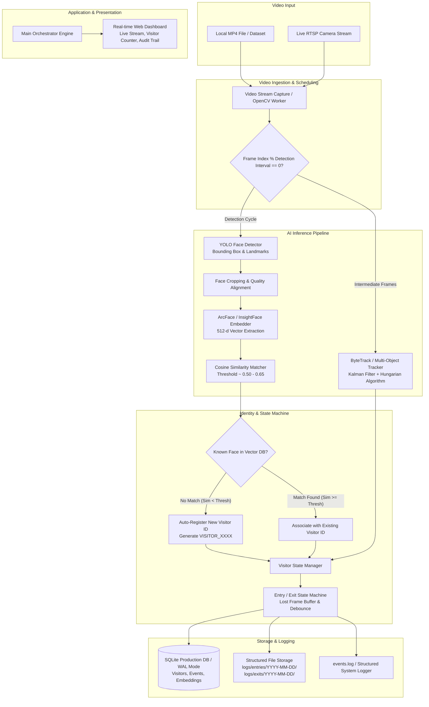

# Intelligent Face Tracker with Auto-Registration & Visitor Counting
## Production Architecture & Implementation Plan

---

### System Architecture Overview

---

### Core Functional Modules Breakdown

| Module | Component | Description & Specification |
|---|---|---|
| **1. Stream Ingestion** | `StreamManager` | Threaded video reader supporting local video files (`.mp4`, `.avi`) and network RTSP streams (`rtsp://...`) with automatic reconnection and drop-frame mitigation. |
| **2. Face Detection** | `YOLOFaceDetector` | YOLOv8-Face detector optimized via ONNX Runtime / PyTorch yielding accurate face bounding boxes and confidence scores. |
| **3. Face Recognition** | `ArcFaceRecognizer` | InsightFace / ArcFace ResNet50 model generating normalized 512-dimensional biometric feature embeddings. Strictly avoids `face_recognition` (dlib) library. |
| **4. Multi-Object Tracking** | `FaceTracker` | High-speed multi-face tracker (ByteTrack/SORT principles) leveraging Kalman filters and IoU + embedding affinity matrices to sustain identity across frame skips. |
| **5. Identity Matcher** | `IdentityRegistry` | Vector registry calculating cosine distance between detected faces and registered identities with configurable recognition thresholds. |
| **6. State Machine** | `VisitorLifecycle` | State tracker handling `FIRST_SEEN`, `ACTIVE`, `LOST`, `EXITED` states. Strictly emits **one Entry event** upon first stable appearance and **one Exit event** upon frame exit after `max_lost_frames`. |
| **7. Storage & Logging** | `StorageManager` | SQLite database with Write-Ahead Logging (WAL) for fault tolerance + structured filesystem image storage (`logs/entries/YYYY-MM-DD/`, `logs/exits/YYYY-MM-DD/`) + `events.log`. |

---

### Compute Load & Resource Consumption Estimates

| Hardware Target | Resolution & FPS | Pipeline Component | CPU Utilization | GPU Utilization (CUDA) | Latency / Frame |
|---|---|---|---|---|---|
| **Intel/AMD x86-64 (CPU-only)** | 1080p @ 30 FPS (`frame_skip=4`) | Detection (YOLOv8n-Face) + ArcFace Embedding + Tracker | 35% – 55% (4 cores) | N/A | ~40 – 65 ms (detection frames), ~8 ms (tracking frames) |
| **NVIDIA RTX GPU (CUDA/TensorRT)** | 1080p @ 30 FPS (`frame_skip=2`) | Batch Inference + ONNX/CUDA Engine | 12% – 18% (Host CPU) | 25% – 40% (2.2 GB VRAM) | ~8 – 14 ms per frame (Real-time 60+ FPS capable) |

